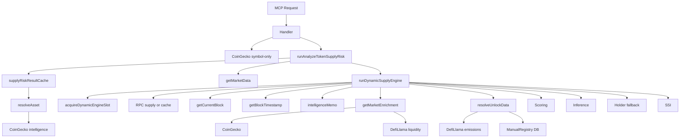

# Full Architecture & Performance Audit

**Scope:** Token Unlock Intelligence MCP — execution flow, bottlenecks, redundancy, simplification.  
**Constraint:** Audit only; no business-logic refactor.

---

## STEP 1 — Full Execution Path: `analyze_token_supply_risk("SOPH")`

### Call chain (with async boundaries)

```
MCP POST /mcp
  → handleCallTool / handleAnalyzeTokenSupplyRisk
       │
       ├─ [SYMBOL-ONLY] fetchCoinGeckoData(token)     ← 1st external (CoinGecko)
       │     → tokenAddress, chainSlug from CG or remain undefined
       │
       └─ Promise.race([
            runAnalyzeTokenSupplyRisk(input, deps),   ← TOOL_TIMEOUT_MS = 35_000
            setTimeout(reject, TOOL_TIMEOUT_MS)
          ])
                │
                ├─ supplyRiskResultCache.getCachedResult(cacheKey)   ← in-memory cache
                │     → if hit: return cached (no further work)
                │
                ├─ resolveAsset({ symbol, token_address, chain })   ← 2nd layer
                │     │
                │     ├─ [core] token_address + chain → immediate EVM return (no network)
                │     └─ [else] resolveAssetIntelligence()
                │           ├─ fetchCoinGeckoData(symbol)            ← 2nd CoinGecko (or 1st if handler skipped)
                │           ├─ resolveTokenBySymbol(symbol, registry)  ← DB / in-memory registry
                │           └─ KNOWN_EVM_SYMBOLS[symbol]            ← in-memory (e.g. SOPH)
                │     → asset.supported === true for SOPH
                │
                ├─ [NON-EVM BRANCH] if !asset.supported:
                │     fetchUnlockData(asset) → resolveUnlockData → DefiLlama → ManualRegistry
                │     return buildUnlockOnlySupplyRisk / buildStructuredNoDataSupplyRisk
                │
                └─ [EVM DYNAMIC PATH] tokenAddress && chainSlug
                      │
                      ├─ getMarketData(symbol, undefined, undefined)   ← 3rd external (MarketAggregator / CG)
                      ├─ AbortController + setTimeout(abort, DYNAMIC_ENGINE_TIMEOUT_MS = 8000)
                      └─ runDynamicSupplyEngine({ ..., asset }, { signal })
                            │
                            ├─ acquireDynamicEngineSlot(signal)        ← concurrency guard (max 2)
                            ├─ asset = input.asset ?? resolveAsset()    ← no-op when asset passed
                            │
                            ├─ getSupplyFromCacheWithTimestamp(addr, chain)
                            │     → else readErc20SupplyFromRpc(chain, addr)   ← RPC (6s timeout)
                            ├─ getCurrentBlock(chainKey)                ← RPC
                            ├─ getBlockTimestamp(chainKey, block)      ← RPC or Etherscan
                            ├─ [deadline check]
                            ├─ getMemoizedResult(memoKey, blockNumber)  ← intelligence memo (60s TTL)
                            │     → if hit: return memoHit (exit engine)
                            │
                            ├─ getMarketEnrichment(symbol, chain, addr, executionNowMs)
                            │     ├─ enrichmentCache.get(key)          ← 5min cache
                            │     ├─ fetchCoinGeckoData(symbol)        ← 4th CoinGecko (3s timeout)
                            │     └─ fetchDefiLlamaLiquidity(chain, address)  ← DefiLlama liquidity (3s)
                            │
                            ├─ resolveUnlockData(asset)
                            │     ├─ DefiLlamaProvider.fetchUnlocks(asset)
                            │     │     └─ fetch(api.llama.fi/emissions/{slug})  ← NO TIMEOUT
                            │     └─ [if no events] ManualRegistryProvider
                            │           └─ query(unlock_events_external)        ← DB
                            │
                            ├─ [scoring: liquidity, pressure, risk tier, forward curve]
                            ├─ shouldApplySupplyShockInference(unlock_data_available)
                            │     → if true: inferSupplyShockUnlock(...)
                            ├─ runHolderDistributionAnalysis(...)      ← 2s deadline, heuristic only
                            ├─ computeSupplyShockFusion(...)
                            ├─ setMemoizedResult(memoKey, blockNumber, out)
                            └─ releaseSlot(); return out
                      │
                      └─ build flat (full), setCachedResult(cacheKey, full), return { success, data: full }
  → normalizeSupplyRiskResult(data, id)
  → safeSend(res, response)
```

### Async boundaries (sequential vs parallel)

| Phase | Operations | Sequential? | Notes |
|-------|------------|------------|--------|
| Handler | CoinGecko (symbol-only) | Yes | Single call |
| Tool | Cache → resolveAsset → getMarketData → engine | Strictly sequential | Market then engine |
| Engine | Slot → Supply (cache or RPC) → Block → BlockTs → Memo check → Enrichment → Unlock → Scoring → Holder → SSI | Strictly sequential | No parallelization |
| Enrichment | CoinGecko then DefiLlama liquidity | Sequential | Could run in parallel |
| Unlock | DefiLlama then ManualRegistry | Sequential (provider order) | By design |

---

## STEP 2 — Performance Bottlenecks

| Stage | What | Classification | Notes |
|-------|------|----------------|--------|
| Handler: fetchCoinGeckoData(token) | Symbol-only upgrade | REDUNDANT when tool also resolves | Same symbol resolved again in resolveAsset |
| resolveAsset (intelligence path) | fetchCoinGeckoData(symbol) | REDUNDANT | 2nd or 3rd CoinGecko for same request |
| Tool: getMarketData(symbol) | Market volume before engine | SLOW / REDUNDANT | Result only used for volume30dUsd; engine later calls getMarketEnrichment (again CoinGecko + DefiLlama) |
| Engine: readErc20SupplyFromRpc | RPC totalSupply/decimals | SAFE (6s timeout) | Can be slow on congested RPC |
| Engine: getCurrentBlock | RPC eth_blockNumber | SAFE (6s) | Sequential after supply |
| Engine: getBlockTimestamp | RPC or Etherscan | SAFE (6s) | Sequential after block |
| Engine: getMarketEnrichment | CoinGecko + DefiLlama liquidity | SLOW | 3s each, sequential; no parallel |
| DefiLlamaProvider: fetch(url) | api.llama.fi/emissions/{slug} | BLOCKING | No timeout; slow/hung server can block |
| ManualRegistryProvider | SQL unlock_events_external | SAFE if indexed | Query by token_symbol, unlock_timestamp |
| runHolderDistributionAnalysis | Heuristic only | SAFE | 2s cap, no RPC |
| resolveUnifiedUnlockIntelligence | Entire file | DEAD | Not imported; unified resolver unused on EVM path |
| runUnlockScanner | Used only inside unifiedUnlockResolver | DEAD on EVM path | Scanner never runs for dynamic EVM flow |
| Concurrency guard | acquireDynamicEngineSlot | BLOCKING (up to 1.5s wait) | Max 2 engines; 3rd request waits |

### Summary

- **REDUNDANT:** Double/triple CoinGecko (handler + intelligence + enrichment); getMarketData + getMarketEnrichment both feed market data.
- **SLOW:** Strictly sequential pipeline (supply → block → timestamp → memo → enrichment → unlock → scoring → holder).
- **BLOCKING:** DefiLlama provider `fetch()` with no timeout; concurrency cap can delay requests.
- **DEAD:** `unifiedUnlockResolver.ts` (resolveUnifiedUnlockIntelligence) and runUnlockScanner on main EVM path.

---

## STEP 3 — Redundant / Unused Systems

| Component | Used by | Status |
|-----------|--------|--------|
| resolveUnifiedUnlockIntelligence | Nothing (removed from engine) | **DEAD** — can delete or repurpose |
| runUnlockScanner | unifiedUnlockResolver only | **DEAD** on EVM path (unified no longer called) |
| fetchOnchainData (dataFetchLayer) | Not used by dynamic path | **UNUSED** for EVM; only non-EVM could use it (they use fetchUnlockData only) |
| fetchExplorerData | Return { success: true } only | **STUB** — no real fetch |
| Registry path (analyze_token_supply_risk) | When !tokenAddress \|\| !chainSlug after resolution | **LIVE** — symbol-only with no address from resolution |
| externalUnlockIngestion (CryptoRank cron) | Populates unlock_events_external | **LIVE** — 403 on free plan; ManualRegistry reads this table |
| CryptoRankProvider | Removed from provider array | **UNUSED** in chain (file still present) |
| supplyRiskResultCache | Tool layer | **LIVE** |
| intelligenceMemo | Engine (after block) | **LIVE** |
| supplyCache (supply from RPC) | Engine + dataFetchLayer | **LIVE** |
| getSupplyFromCacheWithTimestamp | Engine | **LIVE** |

**Duplicated concepts**

- **Unlock resolution:** Two systems — (1) `resolveUnlockData` (DefiLlama + ManualRegistry) used by engine and non-EVM tool path; (2) `resolveUnifiedUnlockIntelligence` (registry → external → scanner → inferred) **not** used. Single effective path is provider engine.
- **Market data:** Tool calls `getMarketData` for volume; engine calls `getMarketEnrichment` (CoinGecko + DefiLlama liquidity). Overlap and double CoinGecko for same symbol.

---

## STEP 4 — Simplification Proposal

### Target structure (consolidated)

```
src/
  core/
    assetResolver.ts           # Keep; single resolution entry
    dataFetchLayer.ts          # Keep fetchUnlockData; remove or repurpose fetchOnchainData/fetchExplorerData if unused
    logger.ts
    ...
  unlock/
    unlockProviderEngine.ts    # Keep; DefiLlama + ManualRegistry
    providers/
      DefiLlamaProvider.ts
      ManualRegistryProvider.ts
      CryptoRankProvider.ts    # Optional; re-add to chain when plan allows
  services/
    dynamicSupply/
      dynamicSupplyEngine.ts   # Keep; only use resolveUnlockData
      supplyCache.ts
      intelligenceMemo.ts
      supplyRiskResultCache.ts
  tools/
    analyze_token_supply_risk.ts
  api/
    registerMcpRoute.ts
  intelligence/
    assetResolution.ts        # Used by core assetResolver
    supplyShockInference.ts
    supplyShockFusion.ts
    unifiedUnlockResolver.ts  # DELETION CANDIDATE (unused on EVM path)
  services/unlockScanner/     # Used only by unifiedUnlockResolver; DEAD on main path — optional removal or “scanner path” re-enable
```

### Concrete deletion candidates (after confirmation)

1. **intelligence/unifiedUnlockResolver.ts** — Not imported; EVM path uses provider engine only.
2. **Unlock scanner pipeline** (runUnlockScanner and deps) — Keep only if you want a future “scanner-only” or “registry + scanner” path; currently unused for EVM.
3. **dataFetchLayer.fetchOnchainData** — Not used by dynamic engine (engine uses its own supply cache + RPC). Non-EVM path does not call it. Can remove or limit to non-EVM if you add that path later.
4. **dataFetchLayer.fetchExplorerData** — Stub; remove or implement.

### Simplification (no delete yet)

- **Single resolution:** Handler should not call fetchCoinGeckoData when tool will call resolveAsset; pass symbol only and let resolveAsset (plus KNOWN_EVM_SYMBOLS) be the single resolution for symbol-only.
- **Single market source in engine:** Either getMarketData (tool) and pass volume + optional enrichment into engine, or only getMarketEnrichment inside engine and drop getMarketData for dynamic path to avoid duplicate CoinGecko.
- **DefiLlama provider:** Add timeout (e.g. 5s) to `fetch(api.llama.fi/emissions/...)` (e.g. AbortSignal + setTimeout or fetch with signal).

---

## STEP 5 — Parallelization Plan

Where safe (no shared mutable state / ordering deps):

1. **Supply + block + unlock in parallel (engine):**  
   After memo miss, run in parallel (with timeouts):
   - `readErc20SupplyFromRpc` (or use cache)
   - `getCurrentBlock` + then `getBlockTimestamp`
   - `resolveUnlockData(asset)`  
   Then continue with enrichment (which may need supply/volume for scoring). So: `Promise.all([supplyOrCache, blockThenTs, resolveUnlockData])` then enrichment then rest.

2. **Enrichment:**  
   `fetchCoinGeckoData(symbol)` and `fetchDefiLlamaLiquidity(chain, address)` can run in parallel (`Promise.all`).

3. **Timeouts:**  
   - DefiLlama emissions: 5s.  
   - All external fetches: 5s (or keep 3s where already set).  
   - RPC: keep 6s or reduce to 5s for consistency.

4. **No parallel across “resolution → engine”:**  
   Keep strict order: resolve asset → then run engine (with optional parallel inside engine as above).

---

## STEP 6 — Caching Plan

| Cache | Key | TTL | Notes |
|-------|-----|-----|--------|
| resolveAsset | symbol + token_address + chain | 5 min | In-memory LRU; avoid repeated CoinGecko/registry for same symbol. |
| fetchOnchainData / supply | (addr, chain) | Already have supplyCache | Keep; consider 1 min TTL if not set. |
| resolveUnlockData | (symbol or addr, chain) | 5 min | In-memory LRU; DefiLlama + ManualRegistry responses. |
| inference results | Do not cache | — | Keep inference path uncached. |

Existing caches to keep:

- supplyRiskResultCache (tool layer)
- intelligenceMemo (engine, 60s, block-drift)
- supplyCache (RPC supply)
- enrichmentCache (5 min in getMarketEnrichment)

---

## STEP 7 — Output Summary

### Execution flow diagram (high level)



### Identified bottlenecks (short)

- Sequential chain: supply → block → blockTs → memo → enrichment → unlock → scoring → holder → SSI.
- Multiple CoinGecko calls per request (handler, intelligence, enrichment).
- getMarketData + getMarketEnrichment overlap.
- DefiLlama emissions fetch has no timeout.
- Concurrency limit (2) can block 3rd request up to 1.5s.

### Redundant modules

- **unifiedUnlockResolver.ts** — unused.
- **runUnlockScanner** (and its pipeline) — unused on EVM path.
- **CryptoRankProvider** — removed from chain; file still present.
- **fetchOnchainData** — unused by dynamic path.
- **fetchExplorerData** — stub only.

### Proposed simplified file structure

- Same as current layout with these changes: drop or repurpose `unifiedUnlockResolver`; treat `unlockScanner` as optional; consolidate resolution and market data to single path per request; add DefiLlama provider timeout.

### Deletion candidates (after confirmation)

1. `src/intelligence/unifiedUnlockResolver.ts` (or refactor into “scanner path” only).
2. Unlock scanner usage (or keep for a dedicated scanner path).
3. Redundant handler CoinGecko when tool does full resolution.
4. Stub `fetchExplorerData` or implement.

### Performance improvement estimate

- **Remove redundant CoinGecko:** 1–2 fewer round-trips (~1–3s) per request.
- **Parallel in engine:** supply + block/ts + unlock in parallel: save ~0.5–2s; enrichment internal parallel: save ~1–2s. Total ~2–4s possible.
- **DefiLlama timeout:** Prevents unbounded wait (could be 10+ min without timeout).
- **Cache resolveAsset + resolveUnlockData (5 min):** Repeat requests for same symbol/address much faster (e.g. &lt;50 ms from cache).
- **Rough total:** From “up to 10 minutes” to **&lt;10–15 s** typical (with timeout safety and parallelization), and **&lt;1 s** for cache hits if resolution + unlock are cached.

---

## Optional — v2 Minimal Architecture (after audit)

- **Single entry:** MCP → `analyze_token_supply_risk` → resolveAsset (cached) → branch supported / unsupported.
- **EVM path:** Run in parallel: supply (or cache), block+ts, resolveUnlockData (cached), getMarketEnrichment (cached). Then scoring, inference, holder, SSI. Single market source (enrichment only), no getMarketData in tool for dynamic path.
- **Unlock:** One source of truth: `resolveUnlockData` (DefiLlama + ManualRegistry). Remove or archive unified resolver and scanner from hot path.
- **Timeouts:** All external calls (RPC, fetch) capped (e.g. 5–6s).
- **Caches:** resolveAsset, resolveUnlockData, supply, enrichment, intelligenceMemo, supplyRiskResultCache as above.

No refactor was performed; this document is audit-only.
